# 내 손안의 경매장, 쏙

---

### 쏙(SSOAK)

> 나에겐 필요 없지만, 남에게는 꼭 필요할 물건들의 판매를 중개함으로써, 판매자와 구매자의 최선의 이득을 보장하는 경매 플랫폼.
>
> 사용하지 않는 물품의 재활용, 아이디어 물품들의 발견 및 활용을 통해 기존의 아이템들에 새로운 가치를 부여하는 서비스.
>
> 중고 물품, 아이디어 물품의 판매를 “경매” 형태로 중개한다. 사용자가 판매할 물품을 등록하면 해당 물품을 구매하고 싶은 사람들이 가격을 제시한다. 경매 진행 기간이 종료되면 가장 높은 금액을 제시한 사람이 물품을 받을 수 있다.

### 👪 팀원 & 역할

---

- `이재경` 팀장, Back-end
- `김현규` Back-end
- `서우림` Back-end
- `강민수` Front-end
- `한슬기` Front-end
- `허재석` Front-end

### 🔨 기술 스택

---

- 이슈 관리
  - Jira
- 형상 관리
  - Github
- 와이어 프레임
  - Figma
- ERD
  - MySQL
- 커뮤니케이션
  - Mattermost
  - Notion
  - Google spreadsheet
  - Google presesntation
- IDE
  - Visual Studio Code
  - Oracle
- Front-end
  - React Native
  - Expo
  - React hooks
  - Redux
  - Redux-Saga
  - StyleSheet
  - Firebase
- Back-end
  - Spring Boot
  - Spring Security
  - Spring Data JPA
  - QueryDSL
  - AWS S3
- Database
  - MySQL
  - Firebase Realtime Database
- Server
  - AWS EC2
- DevOps
  - Docker
  - Nginx

### 📒 프로젝트 기획

[Notion](https://www.notion.so/PJT-738ba44afdde4f11b4ae2f3de7832802)

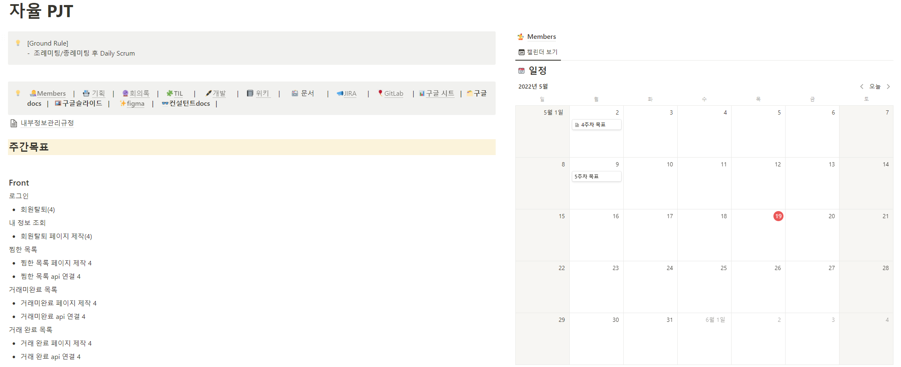

[기능명세서\_GoogleSheet](https://docs.google.com/spreadsheets/d/1sCmVY6OK-BQDsHUbqxuT3qJjknPGeza3/edit#gid=1430994511)

[기능명세서\_Gitlab](https://lab.ssafy.com/s06-final/S06P31A207/-/blob/docs/docs/%EA%B8%B0%EB%8A%A5%EB%AA%85%EC%84%B8%EC%84%9C.pdf)

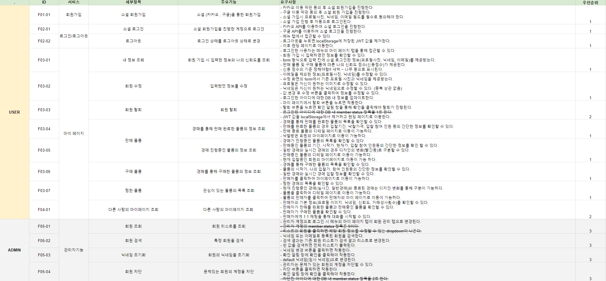

[와이어 프레임](https://www.figma.com/file/eooMEIO65VPFg21u4cwkVR/Untitled)

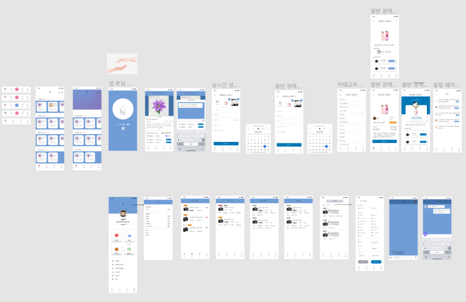

[ERD](https://lab.ssafy.com/s06-final/S06P31A207/-/blob/docs/docs/ERD.pdf)

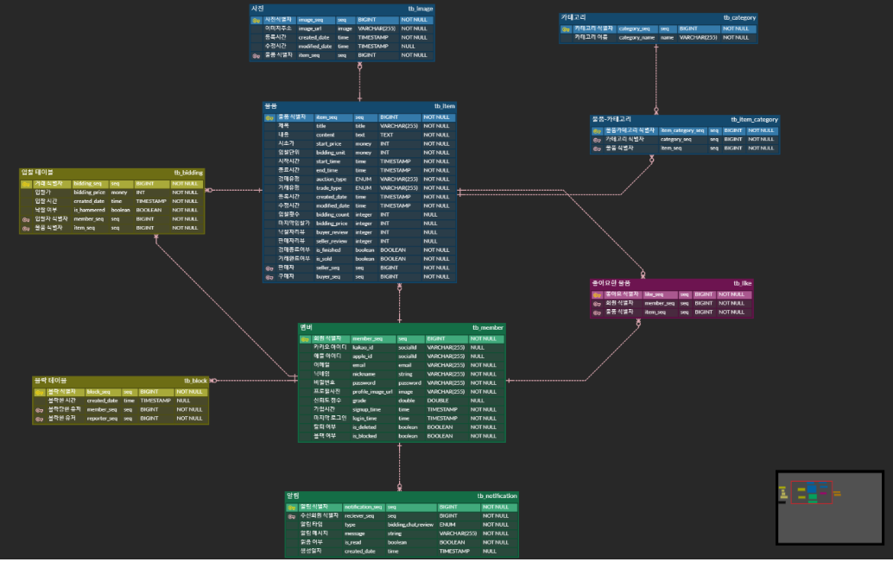

[API 명세서](https://docs.google.com/spreadsheets/d/1sCmVY6OK-BQDsHUbqxuT3qJjknPGeza3/edit#gid=538015543)

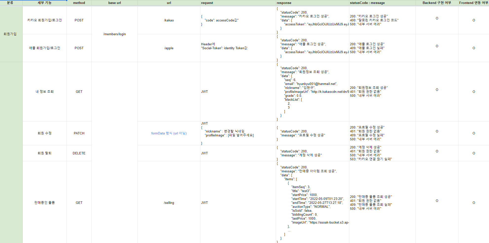

[개발 환경 세팅](ㅁㄴㅇ)

### 프로젝트 진행상황

---

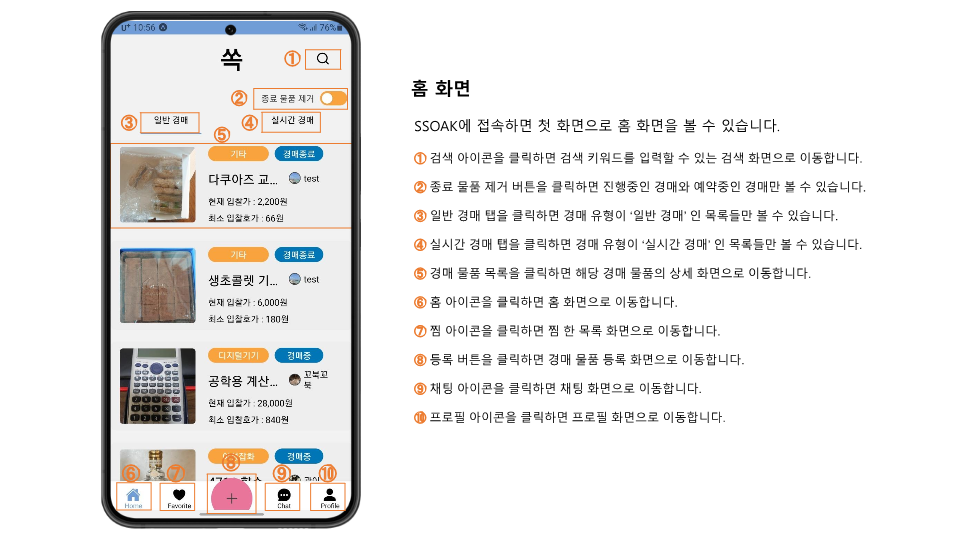

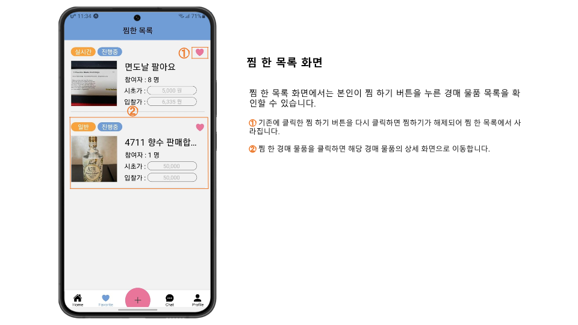

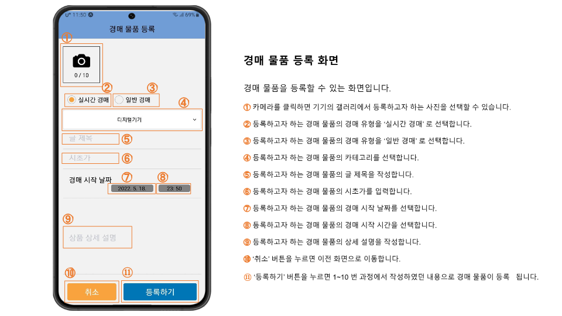

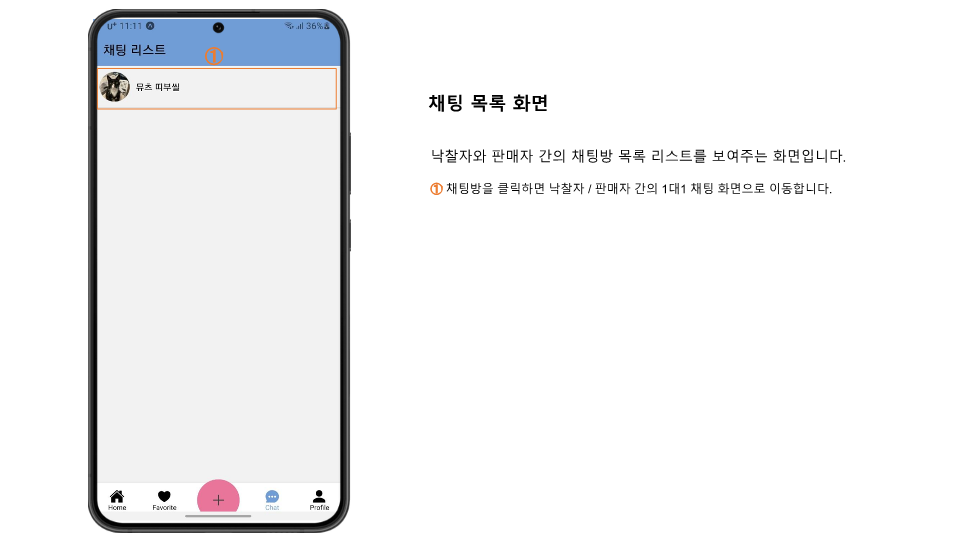

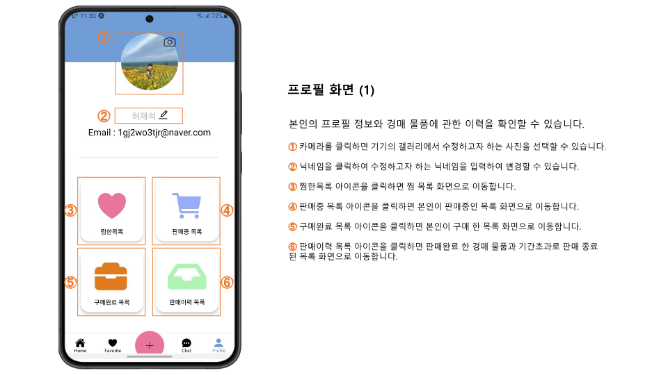

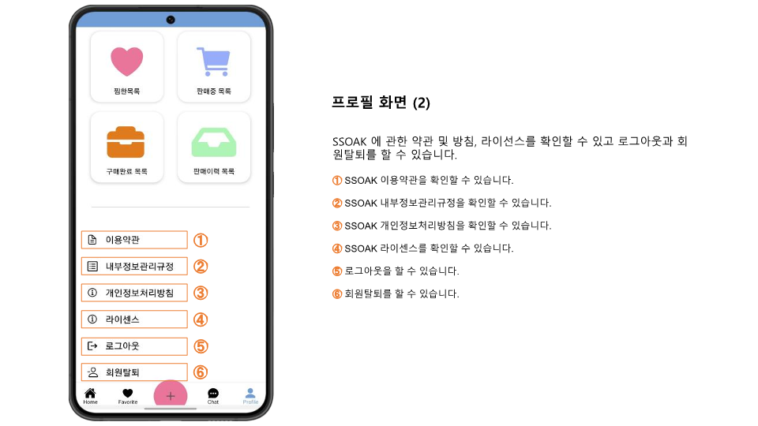

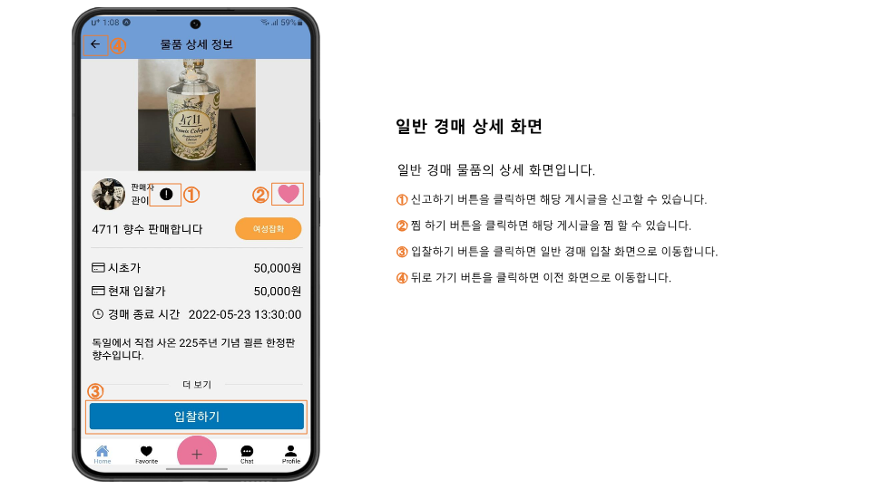

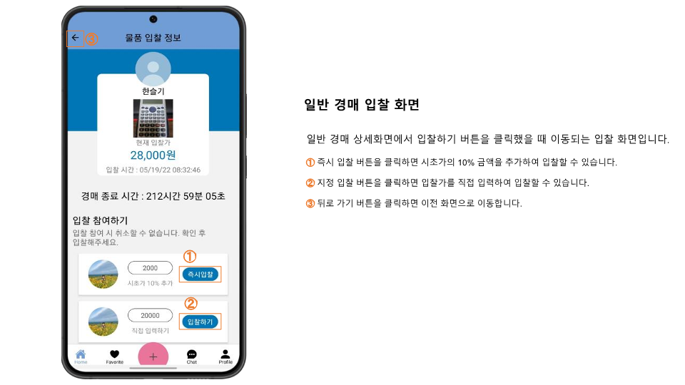

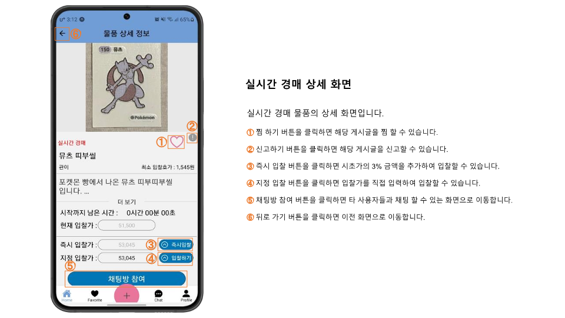

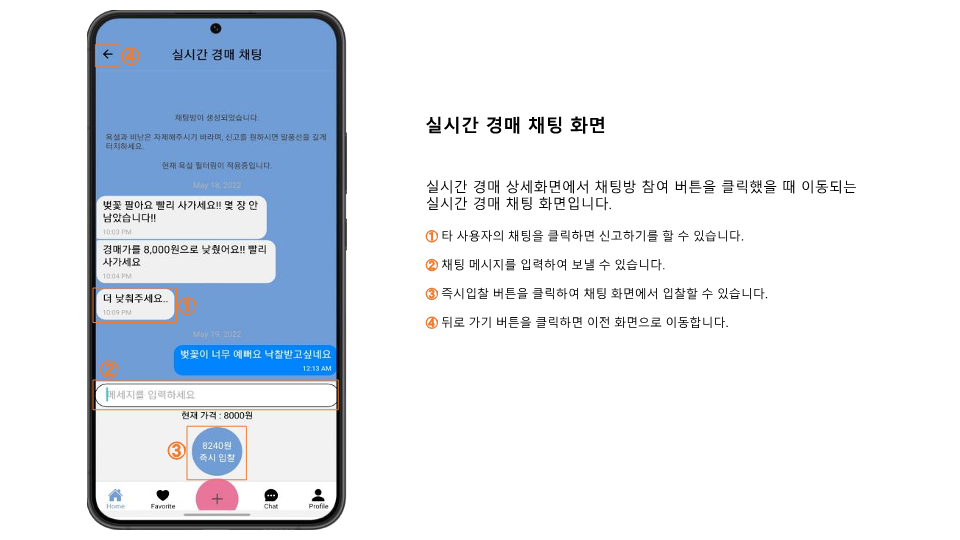

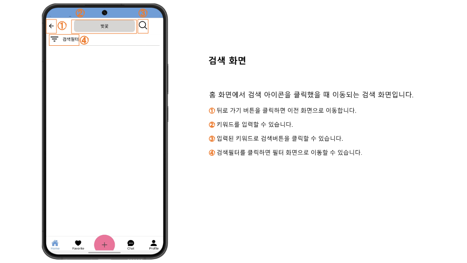

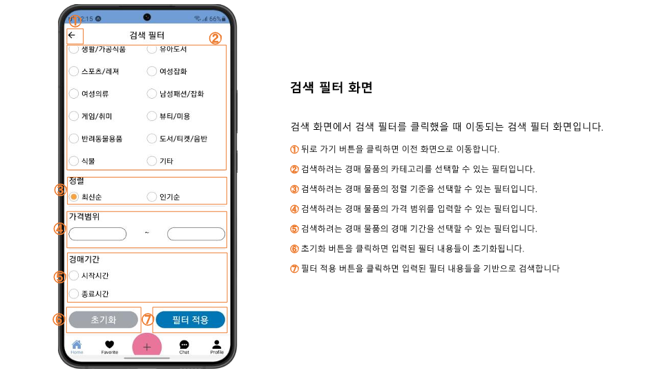

### 서비스 아키텍쳐

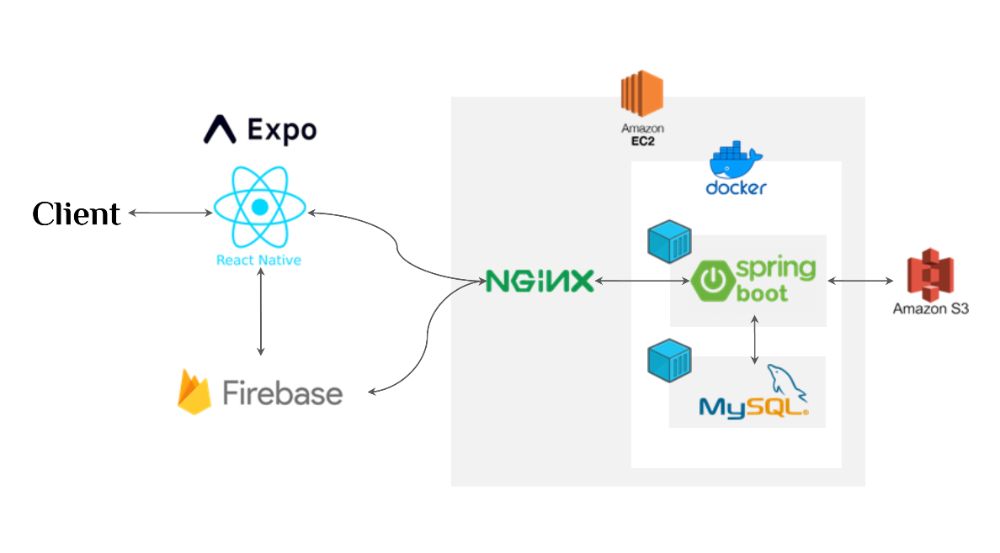
